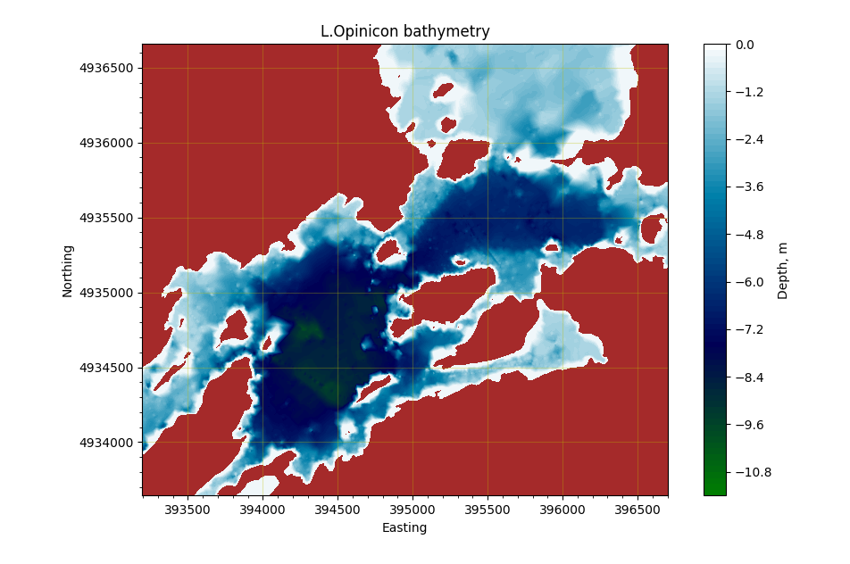

# Create 3D lake model from bathymetry data and lake perimeter (zero depth lines)
This is a set of python modules for bathymetry data processing, including QC, filtering, interpolation, and quality mesh generation. 

Meshes are saved in STL format. 

Example 3D model at Sketchfab: https://skfb.ly/6yprL   

## Data processing workflow:

### Before you start building model ### 

Clean up zero lines. In many cases the number of data points can be significantly reduced without sacrificing much of a quality. ArcMap can be used for this job.

Check for duplicates and remove them from bathymetry data. There was a lot of duplicates in the raw data for L.Opinicon. I used QGIS plugin MMQGIS for this. 

Make sure that bathymetry data points **do not cross zero or offset lines**. This is very important for quality mesh generation.  Consider moving zero lines or bathymetry points depending on what you trust more.

### Step 1 <parallel_offset.py>  generate lines parallel to waterfront (zero depth lines). ###  
Lines offset by a short distance from zero depth lines toward center are necessary to compute correct water perimeter outline. This module generates a set of polylines  parallel to all input polylines found in the input ESRI shapefile. The lines are generated at the distance <i>offDist</i> from the input line, inside or outside of the input polygons. The output is saved in ESRI <i>polyline Z</i> format where Z is (constant) depth. In addition depth is also saved in the record #1 "Depth".

### Step 2 <process_perimeter.py> fill gaps in straight segments and combine zero lines with offset lines 
This script reads depth points from perimeter and perimeter parallel offset files, and combines them in a single shapefile filling gaps in straight line segments. Both files should be in the same projection. 

### Step 3 <combine_bathymetry.py> clean up bathymetry data, combine it with zero lines and triangulate surface
This is the main module performing several tasks: merge closely spaced data points, remove outliers, compute moving average, perform constrained triangulation, and inverse distance interpolation of added points (if any). Triangulation is done with constrained offset lines. At this stage you can also request minimum angle or maximum area constraints.

### Step 4 <triangulate_2.py> triangulate again, now with constrained zero lines only.
This round of triangulation is designed to extend lake bounds to zero lines, extrude zero lines to enhance printed walls, center and scale coordinates 
